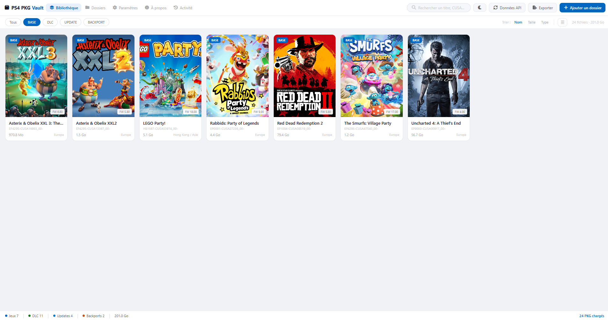
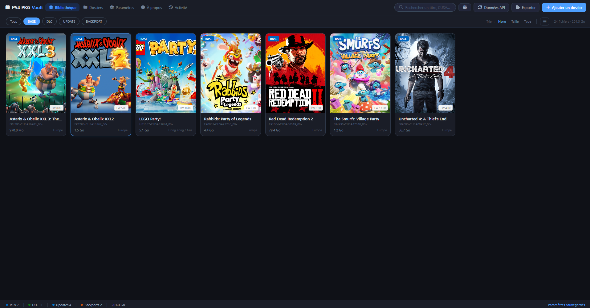
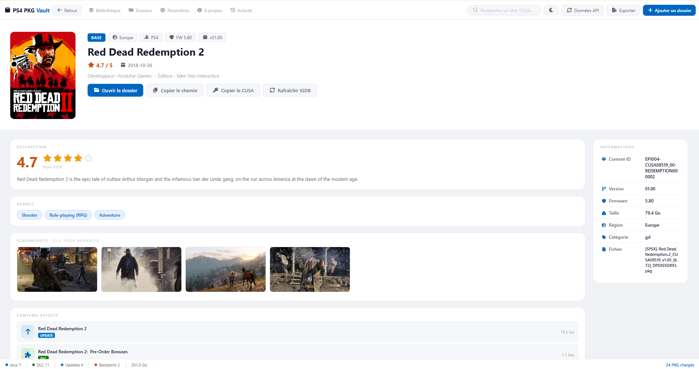
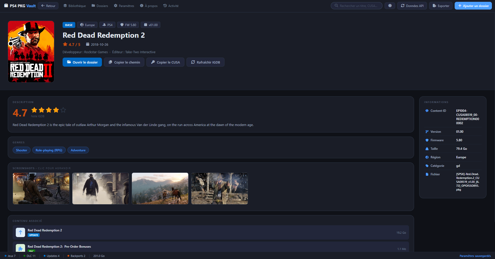
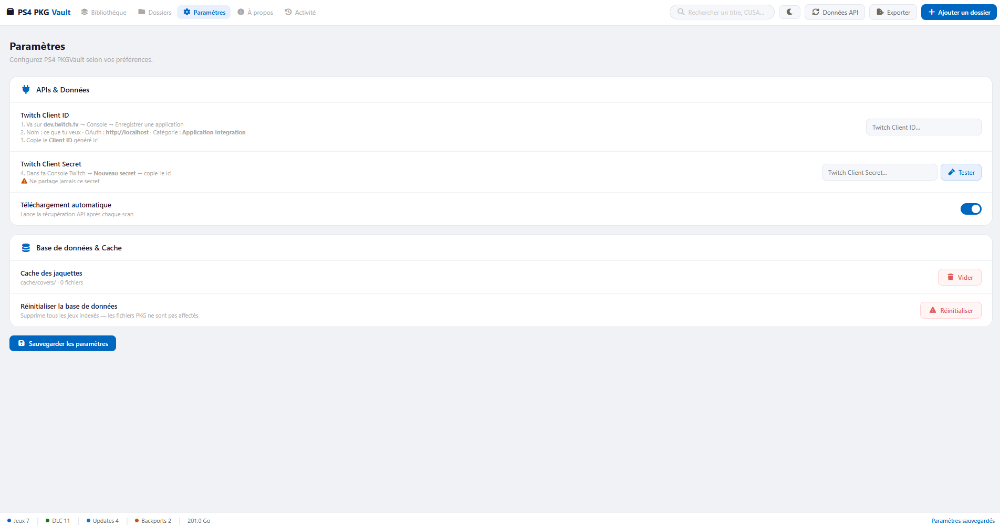

# PKGVault


**Gestionnaire de fichiers PKG PS4** — interface Windows 11, base de données locale, jaquettes HD.

---
### Captures d'écran

### Bibliothèque

| Thème clair | Thème sombre |
|------------|------------|
|  |  |

### Détails d'un jeu

| Thème clair | Thème sombre |
|------------|------------|
|  |  |

### Paramètres




## Présentation

PKGVault est une application de bureau Windows développée en Python/PyQt6.
Elle permet de scanner, organiser et visualiser vos fichiers PKG PS4 (jeux, DLC, updates, backports)
avec une interface moderne inspirée du Microsoft Store / Windows 11.

### Fonctionnalités principales

- Scan récursif de dossiers PKG
- Lecture directe des métadonnées depuis le fichier `param.sfo` embarqué dans chaque PKG
- Détection automatique du type : BASE / DLC / UPDATE / BACKPORT
- Affichage en grille avec jaquettes HD (taille configurable)
- Extraction automatique de `icon0.png` depuis le PKG
- Récupération automatique des métadonnées via **IGDB** (jeux BASE uniquement)
- Propagation automatique des données IGDB aux DLC liés via le CUSA commun
- Téléchargement automatique des jaquettes HD via **IGDB**
- Base de données SQLite locale (persistance entre sessions)
- Page de détail complète : description, genres, screenshots, langues, firmware, contenu associé
- Relations automatiques jeu BASE ↔ DLC ↔ UPDATE
- Recherche et filtres par type
- Menu contextuel : ouvrir dossier, copier chemin, renommer, supprimer
- Vue liste triable (alternative à la grille)
- Thème clair / sombre
- Menu hamburger responsive en petite fenêtre
- Export de la bibliothèque en JSON ou CSV
- Journal d'activité (scans, appels API, erreurs)
- Icônes **Font Awesome 6 Free** intégrées en local

---

## Technologies

| Technologie | Version | Usage |
|---|---|---|
| Python | 3.13+ | Langage principal |
| PyQt6 | 6.x | Interface graphique |
| QWebEngine | 6.x | Rendu HTML/CSS des templates |
| SQLite | 3.x | Base de données locale |
| Jinja2 | 3.x | Moteur de templates HTML |
| Pillow | 12.x | Traitement des images |
| Requests | 2.x | Appels API HTTP |
| IGDB API | v4 | Métadonnées et jaquettes |
| Twitch OAuth | v2 | Authentification IGDB |
| Font Awesome | 6 Free | Icônes |
| PyInstaller | 6.x | Compilation EXE |

---

## Installation

### Prérequis

- Windows 10/11
- Python 3.13+
- pip

### Étapes

```bash
# 1. Cloner le dépôt
git clone https://github.com/rcinformatique/ps4-pkgvault.git
cd ps4-pkgvault

# 2. Créer un environnement virtuel
python -m venv venv
venv\Scripts\activate

# 3. Installer les dépendances
pip install -r requirements.txt

# 4. Lancer l'application
python main.py
```

### Font Awesome (requis)

Télécharger **Font Awesome 6 Free for Web** sur [fontawesome.com/download](https://fontawesome.com/download) et placer les fichiers dans :

```
assets/
└── fontawesome/
    ├── css/
    │   └── all.min.css
    └── webfonts/
        ├── fa-solid-900.woff2
        ├── fa-regular-400.woff2
        ├── fa-brands-400.woff2
        └── (autres fichiers .woff2)
```

### Configuration IGDB

1. Créer un compte sur [dev.twitch.tv](https://dev.twitch.tv)
2. Enregistrer une application → copier le **Client ID** et le **Client Secret**
3. Renseigner les identifiants dans **Paramètres → APIs & Données**

---

## Structure du projet

```
PKGVault/
├── assets/
│   ├── icons/              ← Icône de l'application
│   └── fontawesome/        ← Font Awesome 6 Free (local)
│       ├── css/
│       └── webfonts/
├── cache/
│   ├── covers/             ← Jaquettes téléchargées
│   └── screenshots/        ← Screenshots téléchargés
├── core/
│   ├── __init__.py
│   ├── sfo_parser.py       ← Lecture param.sfo depuis PKG
│   ├── pkg_reader.py       ← Lecture header PKG
│   ├── scanner.py          ← Scan récursif de dossiers
│   ├── database.py         ← Base de données SQLite
│   ├── settings.py         ← Persistance des préférences
│   ├── cover_loader.py     ← Extraction icon0.png
│   ├── api_client.py       ← IGDB + propagation DLC
│   └── activity_log.py     ← Journal d'activité
├── data/
│   └── activity.json       ← Historique des événements (généré)
├── templates/
│   ├── base.html           ← Layout principal + topbar responsive
│   ├── library.html        ← Grille / liste des PKG
│   ├── detail.html         ← Page de détail d'un PKG
│   ├── folders.html        ← Gestion des dossiers
│   ├── settings.html       ← Paramètres
│   ├── activity.html       ← Journal d'activité
│   └── credits.html        ← À propos
├── ui/
│   ├── __init__.py
│   ├── main_window.py      ← Fenêtre principale
│   ├── template_engine.py  ← Moteur Jinja2
│   ├── theme.py            ← Thème et styles Qt
│   ├── topbar.py           ← Barre de navigation
│   ├── subbar.py           ← Filtres et tri
│   ├── pages/
│   │   ├── __init__.py
│   │   ├── library_page.py
│   │   ├── detail_page.py
│   │   ├── folders_page.py
│   │   ├── settings_page.py
│   │   └── credits_page.py
│   └── widgets/
│       ├── __init__.py
│       ├── pkg_card.py     ← Carte jaquette
│       └── status_bar.py   ← Barre de statut
├── tools/
│   ├── read_pkg.py         ← Outil CLI lecture PKG
│   ├── api_pkg.py          ← Outil CLI RAWG
│   ├── extract_covers.py   ← Extraction batch des jaquettes
│   └── inspect_pkg.py      ← Inspecteur PKG détaillé
├── main.py                 ← Point d'entrée
├── requirements.txt
├── README.md
└── CHANGELOG.md
```

---

## Format PKG PS4

### Header PKG

| Offset | Taille | Description |
|---|---|---|
| `0x000` | 4 bytes | Magic : `0x7F434E54` |
| `0x010` | 2 bytes | Nombre d'entrées (BE) |
| `0x018` | 4 bytes | Offset table des entrées (BE) |
| `0x040` | 36 bytes | Content-ID (ASCII) |

### IDs importants

| ID | Contenu |
|---|---|
| `0x1000` | `param.sfo` |
| `0x1200` | `icon0.png` |

### param.sfo — clés utilisées

| Clé | Type | Description |
|---|---|---|
| `TITLE` | UTF-8 | Titre du jeu |
| `CONTENT_ID` | UTF-8 | Content-ID complet |
| `APP_VER` | UTF-8 | Version de l'application |
| `SYSTEM_VER` | INT32 | Firmware minimum requis |
| `CATEGORY` | UTF-8 | Type : gd / gp / ac |
| `LANG` | INT32 | Bitmask des langues |

### Types PKG (CATEGORY)

| Valeur | Type PKGVault |
|---|---|
| `gd`, `gda`, `gdo` | BASE |
| `gp`, `gdp` | UPDATE |
| `ac` | DLC |
| Nom fichier `BACKPORT` | BACKPORT |

---

## APIs externes

### IGDB

- Utilisé par `core/api_client.py`
- URL : https://api.igdb.com
- Requiert un compte Twitch Developer gratuit
- Fournit : titre, description, genres, date de sortie, développeur, éditeur, jaquette, screenshots
- Traite les jeux **BASE** uniquement — les données sont ensuite propagées aux **DLC** liés

---

## Base de données

### Table `games`

| Colonne | Type | Description |
|---|---|---|
| `content_id` | TEXT UNIQUE | Identifiant unique PS4 |
| `title` | TEXT | Titre depuis param.sfo |
| `title_api` | TEXT | Titre depuis IGDB |
| `type` | TEXT | game / dlc / update / backport |
| `firmware` | TEXT | Firmware minimum |
| `cover_path` | TEXT | Chemin local jaquette |
| `description` | TEXT | Description depuis IGDB |
| `genres` | TEXT | JSON array |
| `languages` | TEXT | JSON array |
| `api_fetched` | INTEGER | 0 = pas encore traité |

### Table `game_relations`

| Colonne | Description |
|---|---|
| `base_content_id` | Jeu BASE |
| `related_id` | DLC ou UPDATE lié |
| `relation_type` | dlc / update / backport |

### Table `folders`

| Colonne | Description |
|---|---|
| `path` | Chemin absolu |
| `date_added` | Date d'ajout |
| `enabled` | 1 = actif |

---

## Développeur

**Sébastien Etienne** — RC Informatique  
🌐 https://rc-informatique.fr  
🐙 https://github.com/rcinformatique

---

## Crédits

- Interface développée avec l'assistance de **Claude** (Anthropic) — Sonnet 4.6
- Design inspiré de **Windows 11 / Microsoft Store / Fluent Design**
- Données de jeux via **IGDB**
- Métadonnées, jaquettes et screenshots via **IGDB**
- Icônes via **Font Awesome 6 Free**

---

## Licence

PKGVault est distribué sous la licence GNU General Public License v3.0 (GPL-3.0).

Vous êtes libre d'utiliser, modifier et redistribuer ce logiciel conformément aux termes de la licence GPL v3.

Voir le fichier LICENSE pour plus d'informations.

Ce projet n'encourage aucune violation des droits d'auteur.
Les fichiers PKG utilisés doivent provenir de contenus que vous êtes légalement autorisé à utiliser.

---

*PKGVault v1.1.0 — 2026*